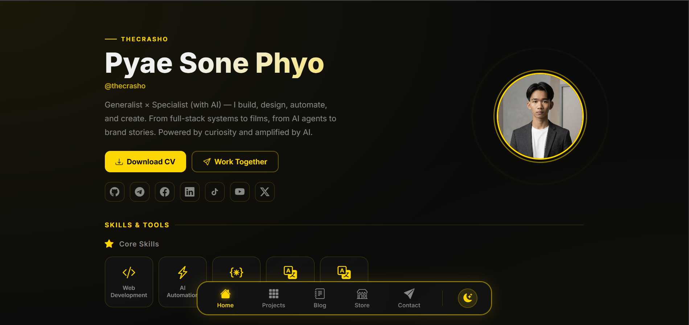

# Hi, I'm Pyae Sone Phyo (ThecrashO)

A web developer and AI workflow builder passionate about creating modern web applications, automation systems, and creative digital experiences.

## About

This repository contains my personal portfolio website, where I showcase my projects, technical skills, blog articles, and digital products.

My current focus includes:

- Web Development
- AI Automation
- Workflow Design
- UI/UX
- Content Creation

## Featured Projects

- Publio – Multi-platform social media publishing platform
- Order2Me – University canteen ordering system
- AI Automation Workflows
- Bootstrap Components

## Tech Stack

Frontend
- HTML
- CSS
- JavaScript
- Bootstrap

Backend & Database
- Supabase
- Node.js

Tools
- Git & GitHub
- Docker
- n8n
- Notion

## Connect With Me

- GitHub: github.com/thecrasho
- Telegram: @thecrashO
- Email: thecrasho99@gmail.com

## License

MIT
